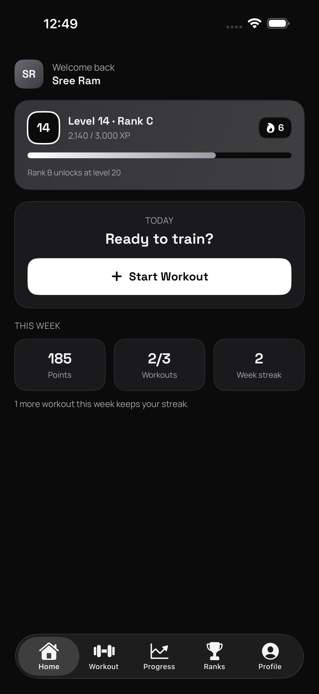
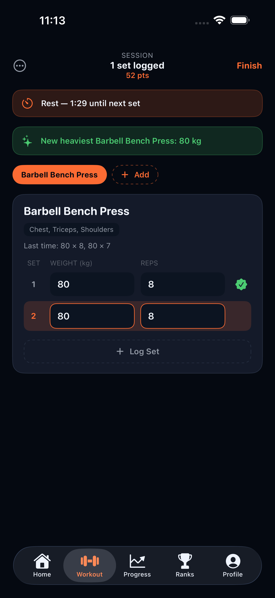
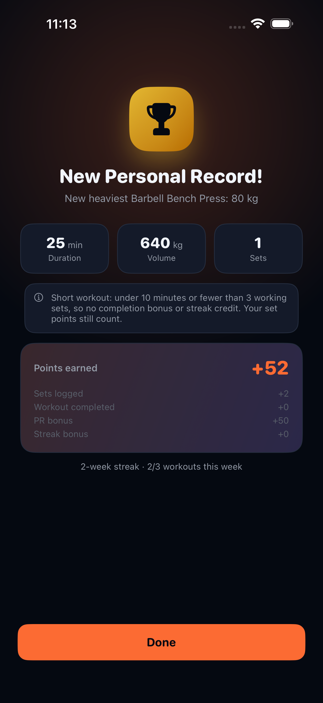
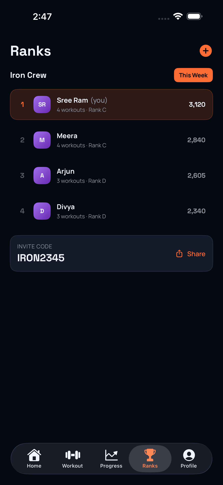
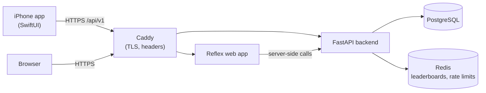

# MetalArm

[](https://github.com/SreeRamVaddi2208/MetalArm/actions/workflows/ci.yml)

**Turn real goals, habits and gym workouts into RPG-style progression.**
Log a set and watch your XP bar move. Break a record and the app celebrates it.
Train with friends in a party and climb the weekly leaderboard.

MetalArm has three parts that share one API:

- **Backend** - FastAPI + PostgreSQL + Redis, with Alembic migrations and JWT auth
- **Web app** - Reflex (Python compiled to React/Next.js)
- **iPhone app** - native SwiftUI, in [`ios/`](ios)

<p align="center">
  
  
  
  
</p>

> **Formerly LevelForge.** A few data-bearing identifiers keep the old name on
> purpose, because existing data lives under them: the Docker volumes
> (`levelforge_postgres_data` etc., pinned in `docker-compose.yml`) and the
> development Postgres role/database (`POSTGRES_USER` / `POSTGRES_DB` =
> `levelforge`). `LEVELFORGE_API_BASE_URL` is still read as a fallback for
> `METALARM_API_BASE_URL`.

---

## Features

- **Workouts** - live sessions that survive a refresh or a device switch, an exercise library of 91 starters plus your own, routines, ghost values from your last session, a rest timer, and editing or deleting sets.
- **Records** - heaviest set, estimated 1RM, session volume and most reps at a weight, detected on the server as you log.
- **Progression** - points become XP, levels and ranks from E to S. Ranks B, A and S also need a strength trial: a bench at 1x, squat at 1.5x and deadlift at 2x bodyweight. Weekly workout streaks, badges and a rewards shop.
- **Quests** - daily, weekly and one-off goals in your own time zone.
- **Parties** - invite codes, a shared quest board, weekly workout leaderboards, and a weekly raid boss the whole party brings down with its workouts (it heals on days nobody trains).
- **Sharing** - a 1080 x 1920 story card of the workout's biggest moment (a rank-up, level-up, record or the points), with your party's invite code, from the iPhone or web summary.
- **Accounts** - sign-up and login with refresh tokens, sign-out on every device, and in-app account deletion.

Every number (points, XP, records, streaks) is computed on the server. No
request accepts a point value.

## Architecture



In development there is no Caddy: the API is on `:8000` and the web app on `:3000`.

## Repository layout

| Path | What it is |
|---|---|
| [`backend/`](backend) | FastAPI app (`app/`), Alembic migrations, exercise importer, pytest suite |
| [`frontend/`](frontend) | Reflex web app (`metalarm/`) |
| [`ios/`](ios) | SwiftUI iPhone app, unit and UI tests, App Store screenshots |
| [`deploy/`](deploy) | Production stack: Compose file, Caddyfile, backups, privacy and support pages |
| [`docs/`](docs) | API contract, workout API guide, data model, deployment guide |
| [`scripts/`](scripts) | API contract generator, smoke test, browser end-to-end test |
| [`.github/workflows/ci.yml`](.github/workflows/ci.yml) | CI: backend tests and image builds, on every push and pull request |
| [`.github/workflows/ios.yml`](.github/workflows/ios.yml) | iOS tests, when `ios/` changes, on pushes to `main`, or on demand |

---

## Quick start (local development)

Requirements: Docker with Compose. For the iPhone app you also need Xcode 26 or newer.

```bash
git clone https://github.com/SreeRamVaddi2208/MetalArm.git
cd MetalArm

cp .env.example .env
# Edit .env and replace every CHANGE_ME placeholder.
# Generate a real secret for each:
python3 -c "import secrets; print(secrets.token_urlsafe(48))"

docker compose up -d --build
```

Schema migrations run automatically: the `migrate` service runs
`alembic upgrade head` and imports the exercise library before the backend
starts, so a fresh clone comes up with a migrated database. It is idempotent,
so it is safe on every start.

Then check that it actually came up:

```bash
docker compose ps
curl -s http://localhost:8000/health | python3 -m json.tool
```

A healthy response reports the real server versions it connected to:

```json
{
  "status": "ok",
  "service": "metalarm-api",
  "dependencies": {
    "postgres": {"connected": true, "server_version": "17.10", "schema": {"ready": true}},
    "redis":    {"connected": true, "server_version": "8.10.1"}
  }
}
```

`/health` checks **readiness, not just liveness**. If Postgres or Redis is
down, or the schema is behind the code, it returns **503** and names the
problem (for example `"database schema is out of date - run 'alembic upgrade head'"`).

### Services

| Service | URL | Notes |
|---|---|---|
| Backend API | http://localhost:8000 | `/docs` for Swagger UI (disabled in production) |
| Web app | http://localhost:3000 | Reflex (UI and state server on one port in production) |
| pgAdmin | http://localhost:5050 | Log in with `PGADMIN_DEFAULT_EMAIL` / `PGADMIN_DEFAULT_PASSWORD` |
| Postgres | `localhost:5434` | Host port 5434; 5432 inside the container |
| Redis | `localhost:6379` | Password required (`REDIS_PASSWORD`) |

Postgres, Redis and pgAdmin are published to **127.0.0.1 only**, so none of
them is reachable from your network. Change `POSTGRES_HOST_PORT` in `.env` if
5434 does not suit you; the backend is unaffected either way.

### Working on one part at a time

Every service builds independently, so a frontend problem never blocks the backend:

```bash
docker compose build backend
docker compose up -d postgres redis backend
docker compose logs -f backend

docker compose build frontend          # separately
```

### Without Docker

```bash
# Backend (needs Postgres and Redis running)
cd backend && python3.14 -m venv .venv && source .venv/bin/activate
pip install -r requirements.txt
uvicorn app.main:app --reload

# Web app
cd frontend && python3.14 -m venv .venv && source .venv/bin/activate
pip install -r requirements.txt
reflex run                             # UI :3000, state server :8001
```

Reflex splits ports in development but **requires a single port in
production**; the Docker image serves both from 3000.

---

## iPhone app

A native SwiftUI app in [`ios/`](ios) for iPhone, iOS 18 and later.

- Sign up or sign in; tokens are stored in the Keychain and refreshed automatically.
- Home: level, rank, XP and this week's streak progress.
- Workout: pick exercises from the library, see last session's numbers, log sets, and get PR, level-up and rest-timer banners. Finish or discard the session. Sets logged without a connection are saved on the phone and sync on their own when it's back.
- Progress: a top-set chart and personal records for each exercise you have trained.
- Ranks: your party's weekly leaderboard, with create, join and share-invite.
- Profile: stats, badges, kg/lb preference, privacy policy, sign out, and delete account.
- Share: the summary and the level-up celebration offer a story card for Instagram, TikTok or Messages.

**Run it:** start the backend (above), open `ios/MetalARM.xcodeproj` in Xcode,
and run the `MetalARM` scheme on an iPhone simulator. The Debug build talks to
`http://127.0.0.1:8000`.

Each build configuration has its own server addresses, set in the
`METALARM_API_BASE_URL` and `METALARM_WEB_BASE_URL` build settings. The
`METALARM_BACKEND_URL` environment variable overrides the API address at run
time.

**Test it:**

```bash
cd ios
xcodebuild test -project MetalARM.xcodeproj -scheme MetalARM \
  -destination 'platform=iOS Simulator,name=iPhone 17'
```

That runs about 30 unit tests (response decoding, token refresh against a
stubbed network, the app model's workflows) and the UI tests (sign-up, the
full workout loop, the level-up celebration, every tab, account deletion) against an in-memory backend
(the `-UITestMockAPI` launch argument). One more UI test drives the real
backend end to end: it signs up a throwaway account, logs a workout, and
deletes the account. It runs only when you opt in:

```bash
TEST_RUNNER_METALARM_LIVE_UI=1 xcodebuild test -project MetalARM.xcodeproj -scheme MetalARM \
  -destination 'platform=iOS Simulator,name=iPhone 17'
```

The UI tests on an iPhone 17 Pro Max produce the App Store screenshot set in
[`ios/AppStore/screenshots/`](ios/AppStore/screenshots).

---

## Look and feel

Both apps share one grey, machined-steel palette, with identical values in
[`ios/MetalARM/Theme/Theme.swift`](ios/MetalARM/Theme/Theme.swift) and
[`frontend/metalarm/theme.py`](frontend/metalarm/theme.py):

| Role | Colour |
|---|---|
| Background, raised, card | `#0B0B0C`, `#121214`, `#1A1A1D` |
| Borders | `#2A2A2E`, `#3A3A40` |
| Text, muted, faint | `#F2F2F4`, `#A8A8B0`, `#7C7C84` |
| Accent (buttons, highlights, XP bar) | white `#FFFFFF` to silver `#9A9AA2` |
| Danger (errors and destructive actions only) | `#E5484D` |
| Ranks E to S | darker to brighter grey, ending in white |

Red is the only colour; everything else is a shade of grey. Use the theme
tokens rather than raw colour values.

Every level-up and rank-up gets a celebration: on iPhone, the new level punches
in with silver rings, metal sparks and a haptic (`Views/LevelUpView.swift`); on
the web, the level-up overlay (`components/level_up.py`). Both fall back to a
plain fade when the system asks for reduced motion.

The app icon's source is [`scripts/icon/metalarm-icon.svg`](scripts/icon/metalarm-icon.svg).
After editing it, re-render the iOS icon (including the tinted variant) and the
web favicons with:

```bash
node scripts/icon/render_icon.mjs
```

---

## Authentication

`POST /api/v1/auth/login` returns a short-lived `access_token` (send it as
`Authorization: Bearer ...`) and a long-lived `refresh_token`.

- `POST /api/v1/auth/refresh` swaps the refresh token for a new pair. A refresh token is never accepted as an access token.
- `POST /api/v1/auth/logout` signs out **this device**: its session is revoked, so its access and refresh tokens stop working while other devices stay signed in. Clients send `{"refresh_token": ...}` (it still works after the access token has expired); a bearer access token alone also works.
- `POST /api/v1/auth/logout-all` signs out **every device**: every token the user holds is revoked.
- `DELETE /api/v1/auth/me` (password confirmation required) deletes the account and all its data. A party the user owns passes to its longest-serving member.
- Login, signup and refresh are rate limited per client address and per account (429 with `Retry-After`).

## Testing

The backend suite runs in its own container against a **separate** database
that is created and dropped for each run, so it never touches your development
data. Test dependencies live in the Dockerfile's `dev` stage and are not in the
production image.

```bash
docker compose run --rm tests                                  # full suite
docker compose run --rm tests pytest tests/test_quests.py -v   # one module
docker compose exec backend alembic check                      # models match the migrations
```

An end-to-end smoke test drives a **running stack** over real HTTP (every
endpoint group, plus ownership isolation) and cleans up after itself:

```bash
docker compose up -d
python3 scripts/smoke_test.py
```

pytest drives the app in-process for speed and isolation; the smoke test proves
the deployed containers, network and migrations actually serve requests.

**Browser end-to-end test:** `scripts/e2e/` drives the real web UI in your
installed Chrome (headless, via `playwright-core`) against a running stack: the
full workout journey, routines, progress, weight unit, profile and party
boards, then every page at phone and desktop width, saving screenshots.

```bash
docker compose up -d
cd scripts/e2e && npm install && node workout_e2e.mjs      # screenshots -> $TMPDIR/metalarm-e2e
```

`CHROME_PATH=/path/to/chrome` overrides the browser.

**CI** ([`.github/workflows/ci.yml`](.github/workflows/ci.yml)) runs the backend
suite and a migration check against Postgres and Redis service containers,
builds both production images, and validates the production Compose file on
every push and pull request. The iOS tests run separately in
[`.github/workflows/ios.yml`](.github/workflows/ios.yml) on a macOS runner, only
for pull requests that touch `ios/`, pushes to `main`, or when started by hand
from the Actions tab, because macOS minutes are expensive on a private repo.

---

## Deploying to production

[`docs/deployment.md`](docs/deployment.md) is the full guide. In short:

```bash
cp deploy/.env.production.example deploy/.env.production   # fill every CHANGE_ME
docker compose -f deploy/docker-compose.prod.yml --env-file deploy/.env.production up -d --build
```

The production stack runs on one Linux server:

- **Caddy** is the only public service (ports 80 and 443) and gets HTTPS certificates automatically.
- The web app is at `https://DOMAIN` and the API at `https://api.DOMAIN`.
- `/docs` and the OpenAPI schema are disabled, and the backend reads real client addresses from the proxy.
- A nightly `pg_dump` runs with 14-day retention; `deploy/backup.sh` handles manual backups and restores.
- `https://DOMAIN/privacy` and `/support` are ready to link from the App Store listing.

The guide also includes the iOS release checklist (Apple Developer account,
signing team, production addresses, App Store Connect listing).

---

## Database migrations

Alembic reads the database URL from the environment, never from `alembic.ini`,
so no credential is committed.

```bash
docker compose exec backend alembic current
docker compose exec backend alembic revision --autogenerate -m "describe change"
docker compose exec backend alembic upgrade head
```

### After changing the XP curve

`level_progress.current_level` and `.rank` are **caches** of the curve in
`backend/app/core/leveling.py`; `total_xp` is the source of truth. Retuning the
curve leaves those columns stale until they are recomputed:

```bash
docker compose run --rm tests python -m scripts.recompute_progression --dry-run
docker compose run --rm tests python -m scripts.recompute_progression
```

### Exercise library

`backend/scripts/import_exercises.py` loads the shared library from
`backend/app/data/exercises.json` (91 starter exercises). The `migrate` service
runs it after every `alembic upgrade head`; it upserts by slug, so repeat runs
change nothing. To load a bigger dataset (JSON, or CSV with `;`-separated muscle
groups):

```bash
docker compose run --rm tests python -m scripts.import_exercises --file path/to/big.csv --dry-run
docker compose run --rm tests python -m scripts.import_exercises --file path/to/big.csv
```

A bad row rejects the whole file. Exercises missing from the file are reported,
never deleted, because workout history points at them.

Workout point values live only in `backend/app/core/workout_rules.py`. Awards
are snapshotted into the points ledger, so retuning never rewrites history.

## API contract

[`docs/api-contract.md`](docs/api-contract.md) is **generated** from the live
OpenAPI spec, so it cannot drift from the code:

```bash
docker compose up -d backend
python3 scripts/generate_api_contract.py
```

The web and iOS clients treat it as the source of truth for endpoint shapes.
[`docs/workouts-api.md`](docs/workouts-api.md) explains the behaviour: what to
call when, and the rules clients must follow.

## Notes for contributors

- **Secrets come from `.env` only.** `.env` and `deploy/.env.production` are gitignored; commit only the `.example` templates.
- **No hand-written JS/TS in the web app.** Reflex owns the Node/React build. `frontend/reflex.lock/` (`package.json` + `bun.lock`) is generated by Reflex and committed on purpose for reproducible builds; never hand-edit it. Bun's lockfile records every platform variant, so a lockfile generated on macOS/arm64 builds cleanly in the Linux containers (the npm lockfile failure in npm/cli#4828 does not apply).
- **Do not use `passlib`.** It fails against `bcrypt>=5` and depends on the `crypt` module removed in Python 3.13 (PEP 594). Use `bcrypt` and `PyJWT` directly.
- **`REFLEX_API_URL` is compiled into the JS bundle**, so changing it needs `docker compose build frontend`, not just a restart.
- **Inline scripts must not write text or classes into React-owned nodes.** The workout rest timer and clock (`components/rest_timer.py`) set only attributes React never manages, and CSS shows them via `content: attr(...)`. Writing `textContent` into server-rendered nodes before hydration throws React error #418.
- The visual direction is inspired by hunter-rank RPG aesthetics. All assets, copy and art in this repo are original work.

## Docs

- [`docs/api-contract.md`](docs/api-contract.md) - generated endpoint reference
- [`docs/workouts-api.md`](docs/workouts-api.md) - workout module behaviour and client rules
- [`docs/data-model.md`](docs/data-model.md) - the schema and why it is shaped that way
- [`docs/launch-checklist.md`](docs/launch-checklist.md) - **start here to launch**: every remaining step, in order
- [`docs/deployment.md`](docs/deployment.md) - production deployment and iOS release checklist
- [`ios/AppStore/metadata.md`](ios/AppStore/metadata.md) - App Store listing text, privacy answers and review notes
- [`docs/progress-log.md`](docs/progress-log.md) - session-by-session development log
